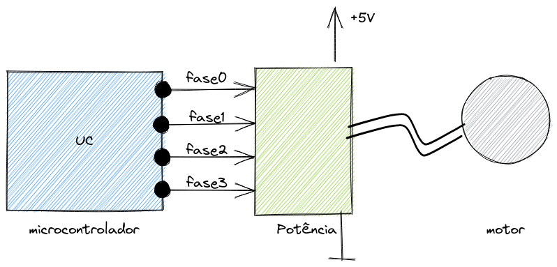
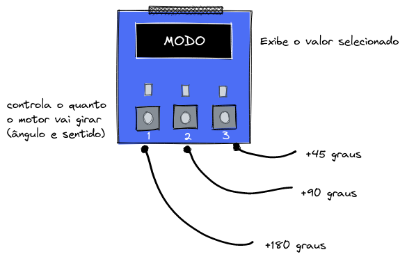
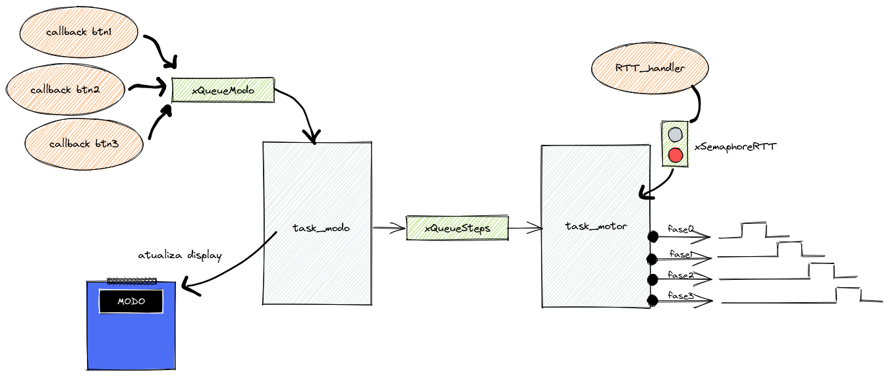
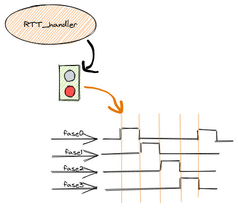

# 22b - AV1 - Motor de passo

Nesta avaliação vocês irão criar um sistema que controla um motor de passos.

## Descricão

Periféricos:

- PIO
- RTT
- OLED

freeRTOS:

- Task
- Queue
- Semaphore

Motor de passos:

- Motor de passo 5V 28BYJ-48
  - Quatro fases
  - `0,17578125` graus por passo / `2048` passos para completar `360`º

### O que é um motor de passo?

O motor de passo é um motor elétrico sem bobinas (_brushless_) que permite movimentarmos o rotor (a parte que gira) em passos. Os passos são valores em graus que dependem da construção do motor e de como ele é acionado.

O `gif` a seguir ilustra um motor de passos em movimento, no caso ele possui quatro fases:

Notem que para fazermos o motor girar é preciso acionar as fases em sequência: `1000` -> `0100` -> `0010` -> `0001` e então repetir esse ciclo, X vezes até obtermos o ângulo de deslocamento esperado. Se o movimento for o oposto: `1000` -> `0001` -> `0010` -> `0100` -> ... o motor irá girar para o lado contrário.

Cada passo (passagem entre `1000` <- -> `0100`) aplica um movimento no rotor de alguns graus (no caso do motor que iremos usar `0,17578125`).

### Interface

A interface do motor de passos com o microcontrolador vai se dar através do acionamento de quatro pinos que é conectado a um módulo de potência:

### Funcionalidade

A entrega deve ser um sistema que permite controlarmos o motor de passos, fazendo-o girar em valores de ângulo pré estabelecidos. O controle do sistema será realizado via a placa OLED e seus botões (não vamos usar os LEDs). O display deve exibir qual foi a opção selecionada:

- BTN 1: Gira o motor 90° no sentido horário
- BTN 2: Gira o motor 360° no sentido horário
- BTN 3: Gira o motor 90° no sentido anti-horário

O diagrama a seguir ilustra a Interface homem-máquina (IHM) prevista:

### firmware

Vocês devem desenvolver o firwamre como indicado a seguir:

Onde:

- Botões:

  - devem ser configurados para funcionar com `callback`
  - devem enviar por uma fila `xQueueModo` um inteiro que representa o ângulo de rotação e a direção
    - exemplo: -90, +360, +90, ....

- `task_modo`
  - Responsável por ler a opcão do usuário via `xQueueModo`
  - Deve fazer a conta e traduzir ângulo em passos
  - Enviar a informação para a fila `xQueueSteps` no seguinte formato `(direção)(número de passos)`:
    - exemplo para -90 -> -90 \* `0.17578125` -> `106` passos
    - o dado que vai para fila é `-106`
  - Exibe no OLED o valor selecionado em graus
- `task_motor`

  - Recebe pela fila a quantidade de passos e o sentido de rotação e aciona o motor
  - Deve usar o RTT para calcular o tempo que cada fase fica acionada (velocidade do motor)
    - A comunicação RTT e task deve ser feita via semáforo `xSemaphoreRTT`

- RTT
  - Irá dar a base de tempo que cada fase fica acionada
  - Configurado em modo alarme para contar 10ms
  - Toda vez que estourar o alarme, liberar semáforo `xSemaphoreRTT`

